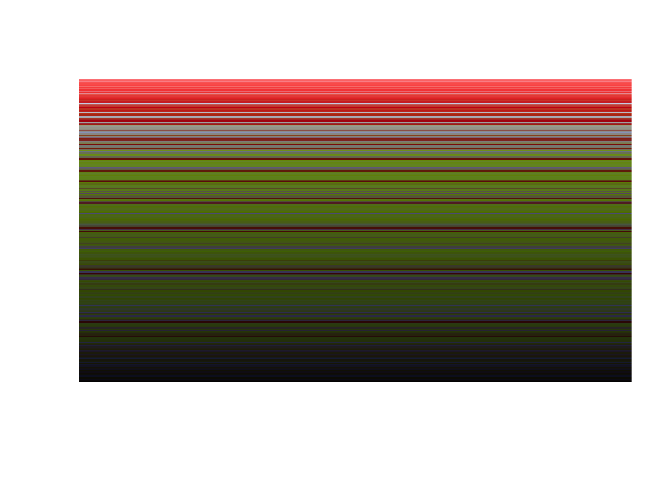

<!-- README.md is generated from README.Rmd. Please edit that file -->

# minitypes

[](https://ci.appveyor.com/project/coolbutuseless/minitypes)
[](https://travis-ci.org/coolbutuseless/minitypes)
[](https://codecov.io/github/coolbutuseless/minitypes?branch=master)


`minitypes` is a collection of type conversion tools for R atomic
vectors.

This package is built upon R’s type conversion tools and aims to:

  - have a consistent interface for converting between types
  - add handling for types not handled by R explicitly e.g. `uint8`

## Supported Types:

  - raw byte
      - This is R’s builtin `raw` byte format.
  - `chr`
      - Ascii/utf8 representation.
  - 1 bit:
      - `logical` - R’s built-in logical type e.g. `c(T, T, F)`
      - `bit` - compact bit representation (from the [bit
        package](https://cran.r-project.org/package=bit))
      - `bitstring` - character representaction of bits e.g. `110`
  - 8 bit
      - `uint8` - R’s built-in integer type. Checked to be within range
        \[0 - 255\]
      - `int8` - R’s built-in integer type. Checked to be within range
        \[-128, 127\]
      - `hex8` - 2 character hexadecimal representation of a `uint8`
  - 16 bit
      - `uint16` - R’s built-in integer type. Checked to be within range
        \[0 - 2^16-1\]
      - `int16` - R’s built-in integer type. Checked to be within range
        \[-2^15, 2^15-1\]
      - `hex16` - 4 character hexadecimal representation of a `uint16`
  - 24 bit
      - `uint24` - R’s built-in integer type. Checked to be within range
        \[0 - 2^24-1\]
      - `hex24` - 6 character hexadecimal representation of a `uint24`
  - 32 bit
      - `int32` - R’s built-in integer type

## Installation

You can install minitypes from github with:

``` r
# install.packages("devtools")
devtools::install_github("coolbutuseless/minitypes")
```

## Promotion Rules

  - types representing single bits will be padded out to be
      - a multiple of 8 bits when converting to `raw`
      - a multiple of 32 bits when converting to `int32`
      - the side to `pad` and the `value` (T/F) to pad with can be
        specified
  - types representing 8-bits can be promoted to 16-bit and 32-bit types
    as long as the correct number of bytes exist e.g.
      - can convert 4 `uint8` values to `int32`
      - can NOT convert 3 `raw` values to `uint16`

## Examples - Functions to convert supported types to/from `raw`

``` r
r <- as.raw(c(1, 2, 0, 255))

raw_to_uint8(r)
#> [1]   1   2   0 255

raw_to_uint16(r, endian = 'little')
#> [1]   513 65280

int32_to_raw(1L, endian = 'big')
#> [1] 00 00 00 01

raw_to_bitstring(r)
#> [1] "00000001000000100000000011111111"

logical_to_raw(c(T, F, F), pad = 'left')
#> logical_to_raw(): padding logical_vec length to a multiple of 8.
#> [1] 04
```

## `convert_type()` - conversion between any two supported types

All supported types can be converted to/from the `raw` type. Thus any
two supported types can be converted between each other by using `raw`
as the intermediary.

However, for complex endian/bit-order conversions (or cases where `raw`
intermediary would lose information about the conversion), it is
probably safer to do it manually as a two-step process.

``` r
convert_type("1111111100010011", src_type='bitstring', dst_type='uint8')
#> [1] 255  19

convert_type(c(1L, 2L, 3L), src_type = 'int32', dst_type = 'uint8', endian = 'big')
#>  [1] 0 0 0 1 0 0 0 2 0 0 0 3
```

## Examples - Specialised conversion functions

`minitypes` includes some functions for direct conversion between two
supported types.

This may be for efficiency reasons, but is often because going through
an intermediate `raw` step would lose information needed for the
complete conversion.

``` r
bitstring_to_logical("100 011")
#> [1]  TRUE FALSE FALSE FALSE  TRUE  TRUE

int32_to_bitstring(1L, endian = 'big')
#> [1] "00000000000000000000000000000001"

int32_to_bitstring(1L, endian = 'little')
#> [1] "00000001000000000000000000000000"

int32_to_bitstring(1L, endian = 'little', first_bit = 'lsb')
#> [1] "10000000000000000000000000000000"
```

## Helper functions

  - `raw_reverse_bits()` - reverse the bits in a raw byte
  - `raw_swap_endian()` - swap the order of a group of bytes (`nbytes`
    at a time) within a raw vector

# Useless tricks - `NA_integer_` & `NA_character_` bit representation

`NA_integer_` and `NA_character_` are just specific bit patterns within
each of those
types.

``` r
convert_type(NA_integer_, 'int32', 'bitstring', endian = 'big', first_bit = 'msb')
#> [1] "10000000000000000000000000000000"

convert_type(NA_character_, 'chr', 'bitstring', endian = 'big', first_bit = 'msb')
#> [1] "0100111001000001"
```

## Worked Example - Parsing a colour table from a ‘gif’

  - Read in a GIF file as raw bytes
  - Manually parse the GIF header (see e.g. [GIF
    format](http://www.onicos.com/staff/iz/formats/gif.html))
  - GIF data is stored little endian
  - In most GIFs there’s a global colour table with 255 colours (defined
    as a block of 255 RGB
triplets)

<!-- end list -->

``` r
#~~~~~~~~~~~~~~~~~~~~~~~~~~~~~~~~~~~~~~~~~~~~~~~~~~~~~~~~~~~~~~~~~~~~~~~~~~~~~~
# A scarlet tanager!
#~~~~~~~~~~~~~~~~~~~~~~~~~~~~~~~~~~~~~~~~~~~~~~~~~~~~~~~~~~~~~~~~~~~~~~~~~~~~~~
gif_filename <- "figures/bird.gif"
gif          <- readBin(gif_filename, 'raw', n = file.size(gif_filename))

head(gif, 50)
#>  [1] 47 49 46 38 39 61 e0 01 40 01 f7 00 00 03 02 02 0c 0b 03 0a 06 07 13
#> [24] 0b 05 14 13 03 1c 1b 04 1d 1b 0b 18 16 07 0b 0a 17 13 0e 19 18 15 19
#> [47] 0e 11 09 38
```


``` r
#~~~~~~~~~~~~~~~~~~~~~~~~~~~~~~~~~~~~~~~~~~~~~~~~~~~~~~~~~~~~~~~~~~~~~~~~~~~~~~
# Subset out the header components and convert to the correct type
#~~~~~~~~~~~~~~~~~~~~~~~~~~~~~~~~~~~~~~~~~~~~~~~~~~~~~~~~~~~~~~~~~~~~~~~~~~~~~~
raw_to_chr(gif[1:6])  # "GIF89a" (text)
#> [1] "GIF89a"

raw_to_uint16(gif[7:8], endian = 'little')  # width (integer)
#> [1] 480

raw_to_uint16(gif[9:10], endian = 'little')  # height (integer)
#> [1] 320

# Is a global colour table present?
colour_table_info <- raw_to_uint8(gif[11])  
if (bitwAnd(colour_table_info, 128L)) { print("GCT present") }
#> [1] "GCT present"

# read 255 RGB triplets has 6-char-hex (i.e. hex24) starting at position 14
colour_table <- raw_to_hex24(gif[seq_len(255*3) + 13L], endian = 'big')
colour_table <- sort(paste0('#', colour_table))

head(colour_table)
#> [1] "#030202" "#0a0607" "#0b0a17" "#0c0b03" "#0d1226" "#0e1025"

image(x = 1, y = 1:255, z = matrix(1:255, nrow = 1), col = colour_table, axes = FALSE, ann = FALSE)
```

<!-- -->
